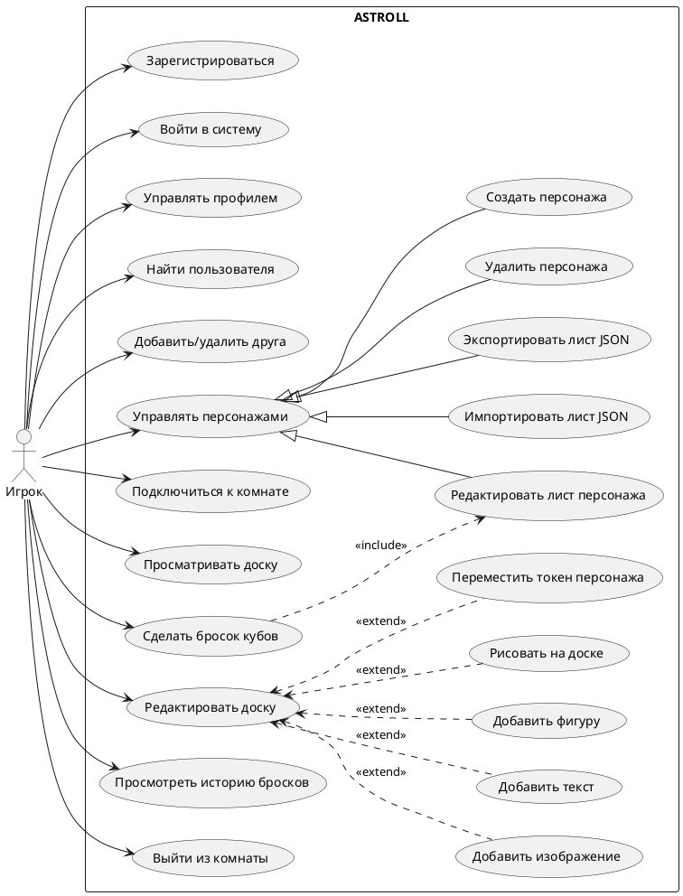

# Диаграмма 1. UML вариантов использования: Игрок

## Промпт
Создай UML use case диаграмму для веб-системы ASTROLL, роли "Игрок". Покажи границу системы "ASTROLL". Актор "Игрок" должен выполнять регистрацию и вход, управление профилем, поиск и добавление друзей, создание/редактирование/удаление персонажей, импорт и экспорт листа персонажа, подключение к комнате по ссылке, просмотр и редактирование доски при наличии прав, бросок кубов от имени персонажа, просмотр истории бросков и выход из комнаты. Для редактирования доски добавь расширения: добавление изображения, текста, фигур, рисование, перемещение токена персонажа. Стиль: аккуратная учебная UML-диаграмма на русском языке.

## PlantUML

