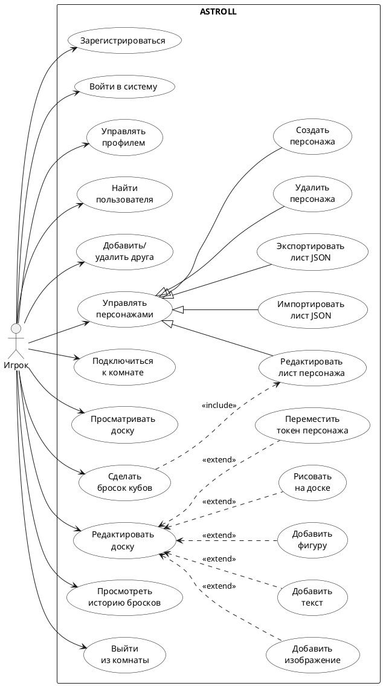

# Диаграмма 1. UML вариантов использования: Игрок (рисунок 1)

## Назначение
Рисунок 1 отчёта ПР8. UML Use Case для роли **Игрок** в системе **ASTROLL**.

## Эталон (что должно получиться)
- Ориентация: **слева направо** или **сверху вниз**; актор **«Игрок»** (stick figure) **слева** от системы.
- Прямоугольная **граница системы** с подписью **«ASTROLL»**.
- Внутри границы — **оваловые** use case на **русском языке**.
- Связи актора с use case — **сплошные линии** без стрелок на стороне актора.
- Отношения **<<include>>** — **пунктирная стрелка** с подписью `<<include>>` (обязательная часть сценария).
- Отношения **<<extend>>** — **пунктирная стрелка** с подписью `<<extend>>` (опциональное расширение).
- Стиль: **учебная UML**, чёрно-белая, без лишних цветов, аккуратная плотная компоновка как в отчёте MDT.

## Промпт для генерации
```
Нарисуй UML Use Case Diagram для веб-системы ASTROLL (Virtual Tabletop для настольных RPG).

Стиль: идентичный учебному отчёту — актор слева, прямоугольная граница системы «ASTROLL», use case овалами внутри, русские подписи, связи include/extend пунктиром.

Актор: Игрок (слева).

Use case (внутри ASTROLL):
- Зарегистрироваться
- Войти в систему
- Управлять профилем
- Найти пользователя
- Добавить/удалить друга
- Управлять персонажами (обобщающий)
  - Создать персонажа
  - Редактировать лист персонажа
  - Импортировать лист JSON
  - Экспортировать лист JSON
  - Удалить персонажа
- Подключиться к комнате
- Просматривать доску
- Редактировать доску (обобщающий)
  - Добавить изображение
  - Добавить текст
  - Добавить фигуру
  - Рисовать на доске
  - Переместить токен персонажа
- Сделать бросок кубов
- Просмотреть историю бросков
- Выйти из комнаты

Связи актора: ко всем верхнеуровневым use case (кроме дочерних).

Generalization: «Управлять персонажами» обобщает 5 дочерних use case.

Include: «Сделать бросок кубов» include «Редактировать лист персонажа» (нужны данные листа).

Extend: «Редактировать доску» extend «Добавить изображение», «Добавить текст», «Добавить фигуру», «Рисовать на доске», «Переместить токен персонажа».

Компоновка: use case сгруппированы логически (аккаунт сверху, персонажи, комната/доска, броски).
```

## PlantUML (готовая реализация)

