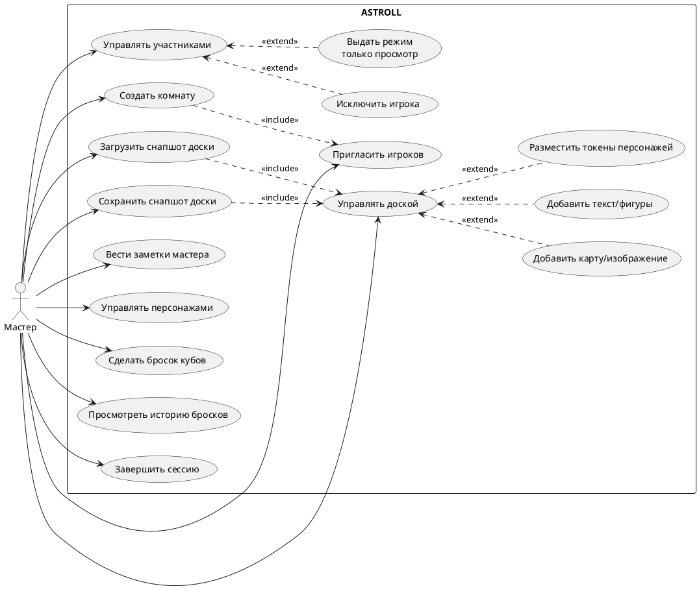

# Диаграмма 2. UML вариантов использования: Мастер

## Промпт
Создай UML use case диаграмму для роли "Мастер" в ASTROLL. Покажи границу системы. Мастер создает комнату, приглашает игроков, управляет участниками, включает режим "только просмотр", исключает игрока, управляет интерактивной доской, сохраняет и загружает снапшоты доски, ведет заметки мастера, управляет персонажами и токенами, инициирует броски и просматривает историю бросков. Используй include/extend там, где действие является обязательной частью или опциональным расширением.

## PlantUML

