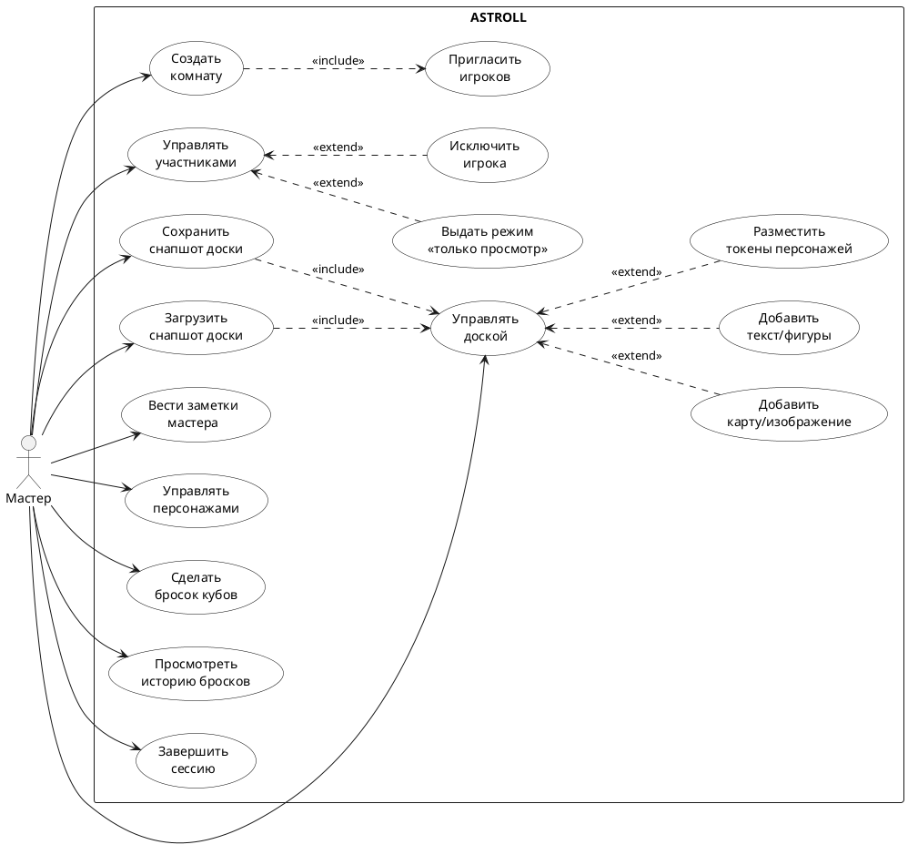

# Диаграмма 2. UML вариантов использования: Мастер (рисунок 2)

## Назначение
Рисунок 2 отчёта ПР8. UML Use Case для роли **Мастер** в системе **ASTROLL**.

## Эталон (что должно получиться)
- Актор **«Мастер»** слева; граница системы **«ASTROLL»**.
- Use case сгруппированы: **комната/участники**, **доска/сцена**, **персонажи**, **броски**, **заметки**.
- **<<include>>**: создание комнаты включает приглашение; сохранение/загрузка снапшота включает управление доской.
- **<<extend>>**: readonly и kick расширяют управление участниками; элементы доски расширяют управление доской.
- Стиль как на рисунке 1 (чёрно-белая учебная UML).

## Промпт для генерации
```
Нарисуй UML Use Case Diagram для роли «Мастер» в системе ASTROLL (онлайн VTT для настольных RPG).

Стиль: как в учебном отчёте MDT — актор слева, граница «ASTROLL», овалы use case, русский язык, include/extend пунктиром.

Актор: Мастер.

Use case:
- Создать комнату
- Пригласить игроков
- Управлять участниками
- Выдать режим «только просмотр»
- Исключить игрока (kick)
- Управлять доской
- Добавить карту/изображение
- Добавить текст/фигуры
- Разместить токены персонажей
- Сохранить снапшот доски
- Загрузить снапшот доски
- Вести заметки мастера
- Управлять персонажами
- Сделать бросок кубов
- Просмотреть историю бросков
- Завершить сессию

Include:
- «Создать комнату» include «Пригласить игроков»
- «Сохранить снапшот доски» include «Управлять доской»
- «Загрузить снапшот доски» include «Управлять доской»

Extend:
- «Управлять участниками» extend «Выдать режим только просмотр»
- «Управлять участниками» extend «Исключить игрока»
- «Управлять доской» extend «Добавить карту/изображение», «Добавить текст/фигуры», «Разместить токены персонажей»

Мастер связан со всеми верхнеуровневыми use case.
```

## PlantUML (готовая реализация)

