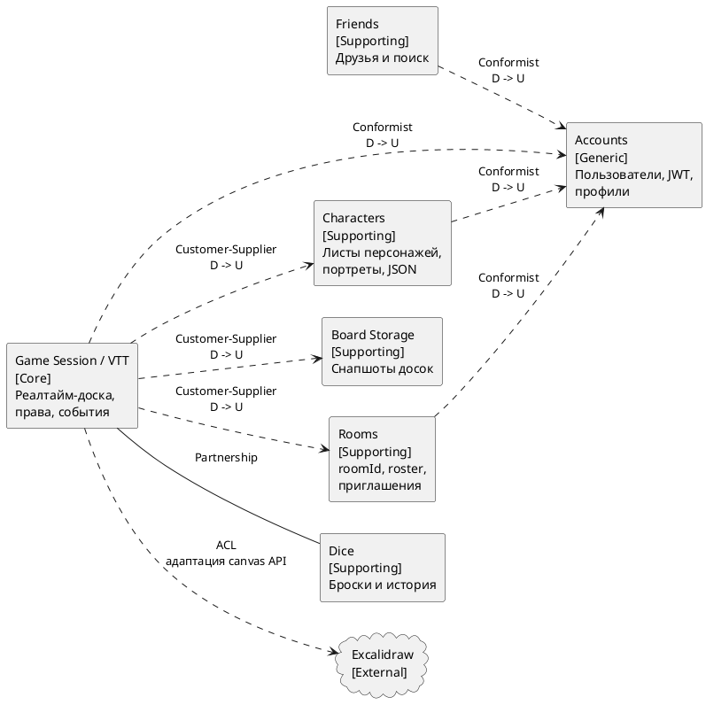

# Диаграмма 3. DDD карта контекстов

## Промпт
Создай DDD context map для ASTROLL. В центре смысловое ядро "Game Session / VTT": комната, синхронная доска, присутствие участников, права мастера и игровые события. Покажи контексты Accounts, Friends, Characters, Board Storage, Rooms, Dice и внешний Excalidraw. Отметь типы отношений: Conformist от доменных контекстов к Accounts, Customer-Supplier от Characters/Board Storage/Rooms к Game Session, Partnership между Game Session и Dice, Anti-Corruption Layer между Game Session и Excalidraw. Подпиши Upstream/Downstream.

## PlantUML

