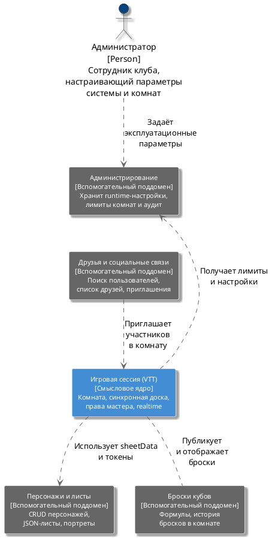

# Диаграмма 3. DDD: карта поддоменов (рисунок 3)

## Назначение
Рисунок 3 отчёта ПР8. **Карта поддоменов** (не context map со стрелками Upstream/Downstream), стиль как в MDT.

## Эталон (что должно получиться)
- Вверху **персона** «Администратор» (иконка человека, тёмно-синий).
- Прямоугольные блоки поддоменов с тремя строками: **название**, **[тип]**, **описание**.
- **Смысловое ядро** — блок **«Игровая сессия (VTT)»** по центру, **голубой фон** (#438DD5), белый текст.
- **Вспомогательные поддомены** — **тёмно-серые** блоки (#666666), белый текст.
- Связи — **пунктирные стрелки** с подписью на русском.
- Компоновка: Admin сверху → Administration; Friends слева внизу → Game Session; Game Session → Administration, Characters, Dice.

## Промпт для генерации
```
Нарисуй DDD subdomain map для системы ASTROLL (онлайн VTT для настольных RPG).

Стиль идентичен отчёту MetalDefectTracker:
- Персона «Администратор» сверху (иконка человека)
- Прямоугольники с [Смысловое ядро] / [Вспомогательный поддомен] / [Поддомен общего назначения]
- Ядро «Игровая сессия (VTT)» — голубой блок по центру
- Остальные — серые блоки
- Пунктирные стрелки с русскими подписями

Поддомены:
1. Администратор [Person] — сотрудник клуба, настраивает параметры системы и комнат
2. Администрирование [Вспомогательный] — хранит runtime-настройки, лимиты комнат, аудит
3. Друзья и социальные связи [Вспомогательный] — поиск пользователей, список друзей, приглашения
4. Игровая сессия (VTT) [Смысловое ядро] — комната, синхронная доска, права мастера, realtime-события
5. Персонажи и листы [Вспомогательный] — CRUD персонажей, JSON-листы, портреты
6. Броски кубов [Вспомогательный] — формулы, история бросков в комнате

Связи (пунктир):
- Администратор → Администрирование: «Задаёт эксплуатационные параметры»
- Друзья → Игровая сессия: «Приглашает участников в комнату»
- Игровая сессия → Администрирование: «Получает лимиты и настройки»
- Игровая сессия → Персонажи: «Использует sheetData и токены»
- Игровая сессия ↔ Броски: «Публикует и отображает броски» (двусторонняя)
```

## PlantUML (готовая реализация)

