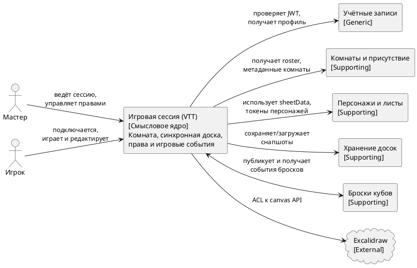

# Диаграмма 4. C4 Context: смысловое ядро

## Промпт
Создай C4 Context диаграмму для смыслового ядра ASTROLL "Игровая сессия (VTT)". Пользователи: Мастер и Игрок. Центральная система: "Игровая сессия: комната, доска, права, события". Вокруг покажи поддомены "Учётные записи", "Комнаты и присутствие", "Персонажи и листы", "Хранение досок", "Броски кубов" и внешнюю библиотеку "Excalidraw". Подпиши назначение связей: JWT и профиль, roster, sheetData и токены, снапшоты, события бросков, canvas API.

## PlantUML

