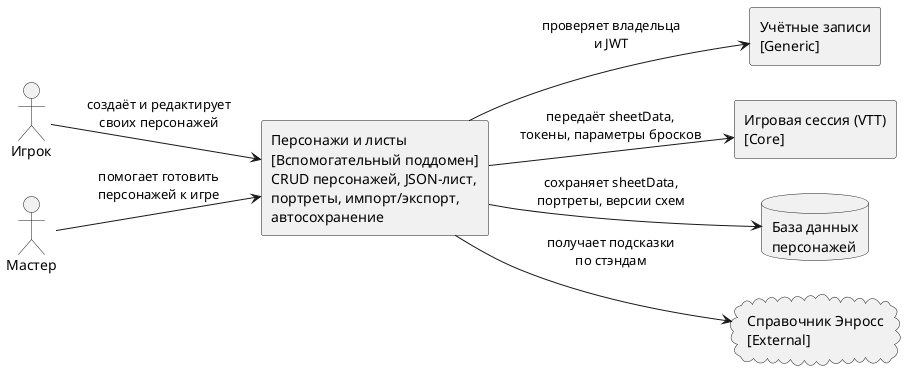

# Диаграмма 5. C4 Context: персонажи и листы

## Промпт
Создай C4 Context диаграмму для вспомогательного поддомена ASTROLL "Персонажи и листы". Центральная система хранит, редактирует, импортирует и экспортирует листы персонажей в JSON, поддерживает портреты, многостраничность и автосохранение. Пользователи: Игрок и Мастер. Покажи связи с "Учётные записи" для владельца и JWT, с "Игровая сессия (VTT)" для передачи sheetData, токенов и данных бросков, с "Справочник Энросс" как внешним источником подсказок по стэндам.

## PlantUML

