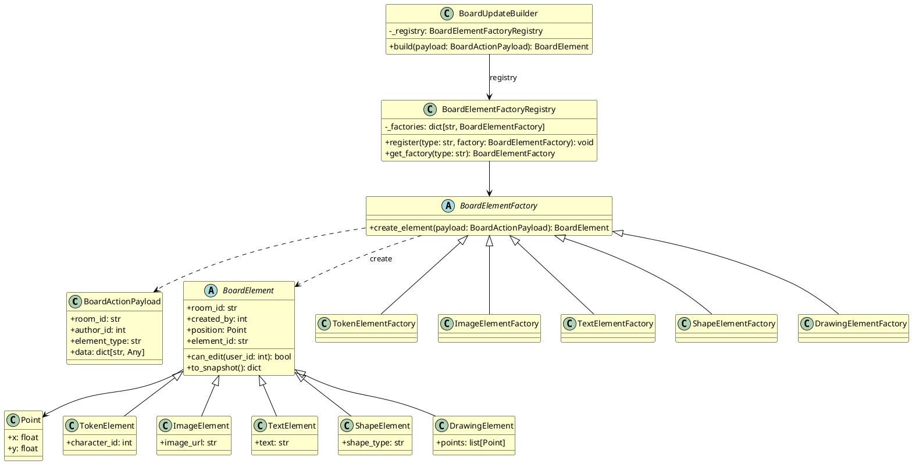

# Диаграмма 6. Порождающий паттерн: Фабричный метод (рисунок 6)

## Назначение
Рисунок 6 отчёта ПР8. UML class diagram паттерна **Factory Method** в `ASTROLL_OLD/backend/apps/board/elements.py`.

## Эталон (что должно получиться)
- **Жёлтый фон** классов (#FEFECE), чёрные границы — как в отчёте MDT.
- Слева вверху: иерархия **BoardElement** ← TokenElement, ImageElement, TextElement, ShapeElement, DrawingElement.
- Слева внизу: **BoardElementFactory** ← конкретные фабрики.
- Справа: **BoardElementFactoryRegistry**, **BoardUpdateBuilder** (клиент).
- **BoardActionPayload** — входные данные (аналог ModelPrediction).
- Наследование — линия с **пустым треугольником**; зависимости — **пунктир**.
- Атрибуты с `-`, методы с `+`, типы через `:`.

## Промпт для генерации
```
Нарисуй UML Class Diagram паттерна «Фабричный метод» для ASTROLL (модуль board/elements.py).

Стиль идентичен отчёту MDT (рис. 6): жёлтые классы, чёрные стрелки, layout:
- верх слева: абстрактный продукт BoardElement и 5 подклассов
- центр: BoardActionPayload (вход)
- низ слева: BoardElementFactory и 5 конкретных фабрик
- справа: BoardElementFactoryRegistry и BoardUpdateBuilder (клиент DetectionResultBuilder)

Классы:
BoardActionPayload: +room_id: str, +author_id: int, +element_type: str, +data: dict
Point: +x: float, +y: float

abstract BoardElement: +room_id, +created_by, +position: Point, +element_id: str, +can_edit(user_id): bool, +to_snapshot(): dict
TokenElement: +character_id: int
ImageElement: +image_url: str
TextElement: +text: str
ShapeElement: +shape_type: str
DrawingElement: +points: list[Point]

abstract BoardElementFactory: +create_element(payload: BoardActionPayload): BoardElement
TokenElementFactory, ImageElementFactory, TextElementFactory, ShapeElementFactory, DrawingElementFactory

BoardElementFactoryRegistry: -_factories: dict, +register(type, factory), +get_factory(type): BoardElementFactory
BoardUpdateBuilder: -_registry: BoardElementFactoryRegistry, +build(payload): BoardElement

Связи: наследование продуктов и фабрик; Builder→Registry→Factory; Factory..>BoardElement, Factory..>BoardActionPayload
```

## PlantUML (готовая реализация)

