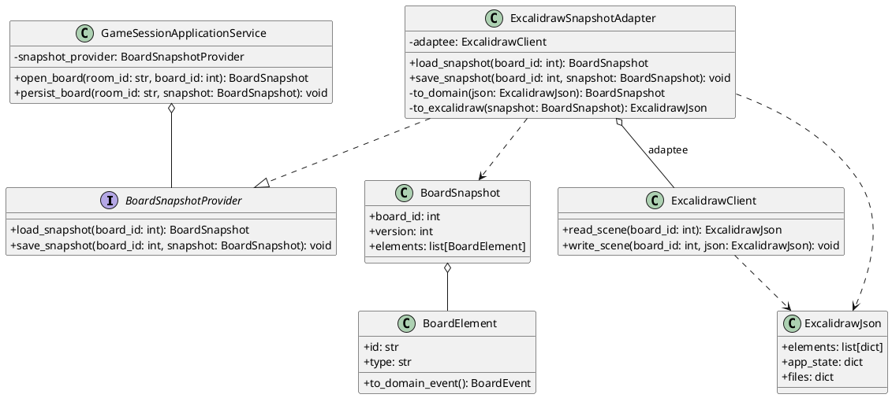

# Диаграмма 7. Структурный паттерн: Адаптер

## Промпт
Создай UML class diagram для паттерна "Адаптер" в ASTROLL. Внутренний сервис GameSessionApplicationService работает с интерфейсом BoardSnapshotProvider. Сторонний формат ExcalidrawClient возвращает и принимает ExcalidrawJson. ExcalidrawSnapshotAdapter преобразует внешний JSON в доменные BoardSnapshot, BoardElement и обратно. Покажи, что адаптер реализует порт ядра и содержит ссылку на adaptee.

## PlantUML

