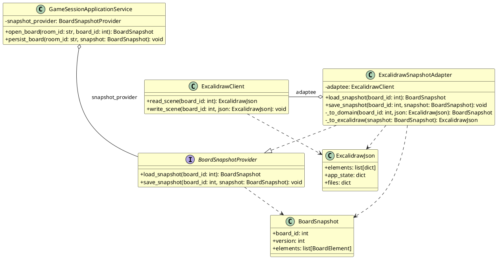

# Диаграмма 7. Структурный паттерн: Адаптер (рисунок 7)

## Назначение
Рисунок 7 отчёта ПР8. UML class diagram паттерна **Adapter** в `ASTROLL_OLD/backend/apps/board/adapters.py`.

## Эталон (что должно получиться)
- Layout **2×2** как в MDT:
  - **верх слева**: `GameSessionApplicationService` (клиент) с агрегацией ◇ к порту
  - **верх справа**: `BoardSnapshotProvider` (target interface)
  - **низ слева**: `ExcalidrawClient` (adaptee, внешний сервис)
  - **низ справа**: `ExcalidrawSnapshotAdapter` (адаптер, наследует порт, содержит adaptee)
- Жёлтые классы, подпись **adaptee** на агрегации.
- Код: `board/adapters.py`.

## Промпт для генерации
```
Нарисуй UML Class Diagram паттерна «Адаптер» для ASTROLL (board/adapters.py), layout как в отчёте MDT рис. 7.

2×2 компоновка, жёлтые классы:

Верх слева — GameSessionApplicationService:
- -snapshot_provider: BoardSnapshotProvider
- +open_board(room_id: str, board_id: int): BoardSnapshot
- +persist_board(room_id: str, snapshot: BoardSnapshot): void
Агрегация (ромб) к BoardSnapshotProvider, подпись snapshot_provider

Верх справа — interface BoardSnapshotProvider:
- +load_snapshot(board_id: int): BoardSnapshot
- +save_snapshot(board_id: int, snapshot: BoardSnapshot): void

Низ слева — ExcalidrawClient (внешняя библиотека):
- +read_scene(board_id: int): ExcalidrawJson
- +write_scene(board_id: int, json: ExcalidrawJson): void

Низ справа — ExcalidrawSnapshotAdapter implements BoardSnapshotProvider:
- -adaptee: ExcalidrawClient
- +load_snapshot(...), +save_snapshot(...)
- -_to_domain(...), -_to_excalidraw(...)

Также: BoardSnapshot (elements, version), ExcalidrawJson (elements, app_state, files).

Adapter наследует BoardSnapshotProvider; Adapter o-- ExcalidrawClient : adaptee
```

## PlantUML (готовая реализация)

