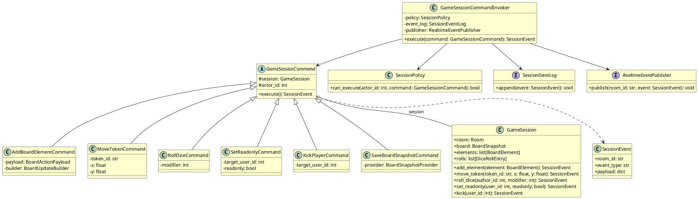

# Диаграмма 8. Поведенческий паттерн: Команда (рисунок 8)

## Назначение
Рисунок 8 отчёта ПР8. UML class diagram паттерна **Command** в `ASTROLL_OLD/backend/apps/game_session/commands.py`.

## Эталон (что должно получиться)
- **GameSessionCommand** (abstract) — базовый интерфейс с `#session`, `#actor_id`, `+execute(): SessionEvent`.
- Конкретные команды наследуют базовый класс (пустой треугольник вверх).
- **GameSession** — получатель (receiver), агрегация от команд.
- **GameSessionCommandInvoker** — invoker с `SessionPolicy`, `SessionEventLog`, `RealtimeEventPublisher`.
- Жёлтые классы, layout как MDT Verification commands.
- Команды: AddBoardElement, MoveToken, RollDice, SetReadonly, KickPlayer, SaveBoardSnapshot.

## Промпт для генерации
```
Нарисуй UML Class Diagram паттерна «Команда» для ASTROLL (game_session/commands.py), стиль рис. 8 MDT.

Жёлтые классы, русские имена классов допустимы на английском как в коде.

abstract GameSessionCommand:
  #session: GameSession
  #actor_id: int
  +execute(): SessionEvent

Конкретные команды:
- AddBoardElementCommand (-payload: BoardActionPayload, -builder: BoardUpdateBuilder)
- MoveTokenCommand (-token_id: str, -x: float, -y: float)
- RollDiceCommand (-modifier: int)
- SetReadonlyCommand (-target_user_id: int, -readonly: bool)
- KickPlayerCommand (-target_user_id: int)
- SaveBoardSnapshotCommand (-provider: BoardSnapshotProvider)

GameSession (receiver):
  +room: Room, +board: BoardSnapshot, +elements, +rolls
  +add_element(), +move_token(), +roll_dice(), +set_readonly(), +kick()

GameSessionCommandInvoker:
  -policy: SessionPolicy
  -event_log: SessionEventLog
  -publisher: RealtimeEventPublisher
  +execute(command: GameSessionCommand): SessionEvent

SessionPolicy, SessionEventLog (interface), RealtimeEventPublisher (interface)
SessionEvent: +room_id, +event_type, +payload

Наследование команд; GameSessionCommand o-- GameSession; Invoker → Policy, Log, Publisher, Command
```

## PlantUML (готовая реализация)

