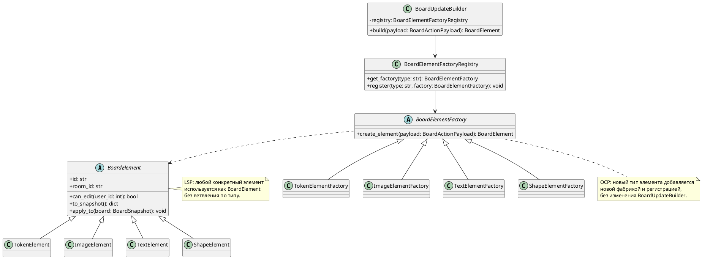

# Диаграмма 9. SOLID: OCP и LSP для элементов доски

## Промпт
Создай UML/C4 Code диаграмму, показывающую применение OCP и LSP в ASTROLL. BoardUpdateBuilder работает только с абстракцией BoardElementFactory и абстрактным продуктом BoardElement. Все элементы доски имеют одинаковый контракт can_edit, to_snapshot, apply_to. Добавление нового типа элемента не требует изменения клиентского кода. Покажи, что TokenElement, ImageElement, TextElement и ShapeElement могут подставляться вместо BoardElement без проверок типа.

## PlantUML

