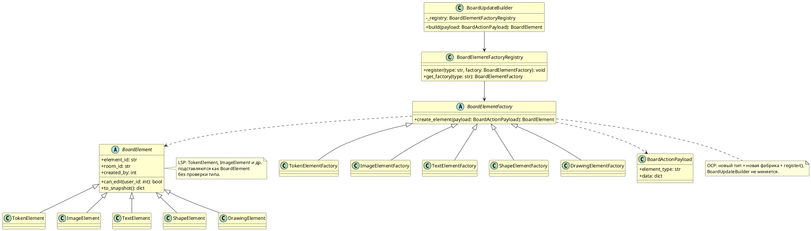

# Диаграмма 9. SOLID: OCP и LSP (рисунок 9)

## Назначение
Рисунок 9 отчёта ПР8. UML после исправления **LSP**: все элементы доски имеют **единый контракт** `BoardElement`.

## Эталон (что должно получиться)
- Как рис. 6, но **все подклассы BoardElement** реализуют **одинаковые методы** (`can_edit`, `to_snapshot`) — **без «особых» методов** у отдельных типов.
- **BoardUpdateBuilder** не делает `isinstance` — работает только через `BoardElementFactory` и `BoardElement`.
- Жёлтые классы; примечания OCP/LSP справа (optional note).
- Отражает `board/elements.py` после рефакторинга LSP.

## Промпт для генерации
```
Нарисуй UML Class Diagram для ASTROLL, демонстрирующий OCP и LSP (рис. 9 MDT).

Контекст: фабрика элементов доски. Все конкретные элементы (Token, Image, Text, Shape, Drawing) — полноценные подтипы BoardElement с ОДИНАКОВЫМ контрактом:
- can_edit(user_id: int): bool
- to_snapshot(): dict

Никаких дополнительных публичных методов только у одного подтипа (исправление LSP).

OCP: BoardUpdateBuilder и BoardElementFactoryRegistry не меняются при добавлении нового типа — достаточно новой фабрики и register().

Покажи:
abstract BoardElement + 5 подклассов
abstract BoardElementFactory + 5 фабрик
BoardElementFactoryRegistry, BoardUpdateBuilder

Builder.build() возвращает BoardElement — клиент не знает конкретный тип.

Добавь note: «LSP: любой элемент подставляется как BoardElement» и «OCP: расширение через новую фабрику».
```

## PlantUML (готовая реализация)

