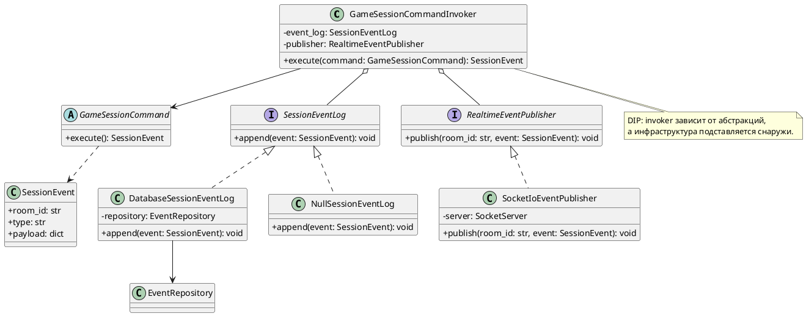

# Диаграмма 10. SOLID: DIP для журналирования команд

## Промпт
Создай UML/C4 Code диаграмму для принципа инверсии зависимостей в ASTROLL. Высокоуровневый GameSessionCommandInvoker не должен зависеть от конкретного журнала в базе или от WebSocket-публикатора. Он зависит от интерфейсов SessionEventLog и RealtimeEventPublisher. Конкретные классы DatabaseSessionEventLog, NullSessionEventLog и SocketIoEventPublisher реализуют эти интерфейсы.

## PlantUML

