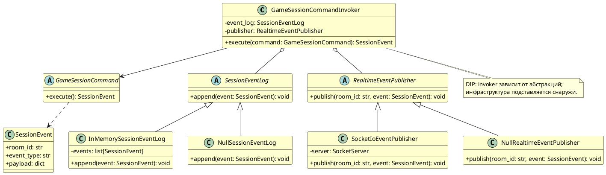

# Диаграмма 10. SOLID: DIP (рисунок 10)

## Назначение
Рисунок 10 отчёта ПР8. UML с **инверсией зависимостей**: invoker зависит от абстракций лога и публикации.

## Эталон (что должно получиться)
- Как MDT рис. 10: **GameSessionCommandInvoker** → абстрактные **SessionEventLog**, **RealtimeEventPublisher**.
- **Null Object**: `NullSessionEventLog`, `NullRealtimeEventPublisher`.
- Конкретные: `InMemorySessionEventLog`, `SocketIoEventPublisher` (или `DatabaseSessionEventLog`).
- Жёлтые классы; invoker **не** зависит от конкретной БД или WebSocket.

## Промпт для генерации
```
Нарисуй UML Class Diagram для ASTROLL, демонстрирующий DIP (рис. 10 MDT).

GameSessionCommandInvoker (высокоуровневая политика) зависит от:
- abstract SessionEventLog (+append)
- abstract RealtimeEventPublisher (+publish)

Конкретные реализации:
- InMemorySessionEventLog implements SessionEventLog
- NullSessionEventLog implements SessionEventLog (Null Object)
- SocketIoEventPublisher implements RealtimeEventPublisher
- NullRealtimeEventPublisher implements RealtimeEventPublisher

Также GameSessionCommand (abstract) с execute(): SessionEvent.

Invoker НЕ зависит от InMemorySessionEventLog или SocketIo напрямую — только от интерфейсов.

Layout: Invoker слева, абстракции по центру, реализации справа/снизу. Жёлтые классы.
```

## PlantUML (готовая реализация)

