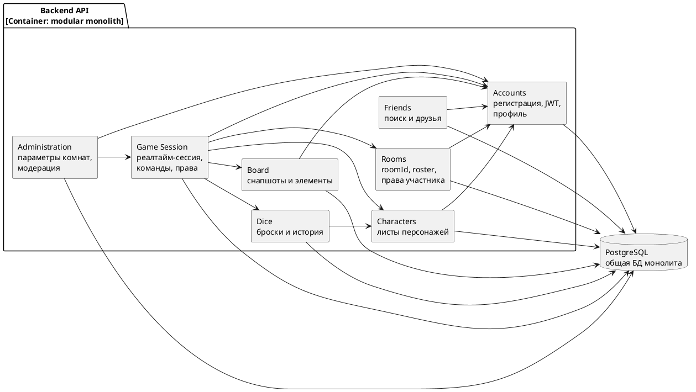

# Диаграмма 11. C4 Components: модульный монолит ASTROLL

## Промпт
Создай C4 Component диаграмму backend ASTROLL как модульного монолита. Контейнер "Backend API" содержит компоненты: Accounts, Friends, Characters, Rooms, Board, Dice, Game Session, Administration. Покажи зависимости без циклов: Game Session зависит от Accounts, Rooms, Characters, Board и Dice; Friends зависит от Accounts; Characters зависит от Accounts; Board зависит от Accounts; Administration зависит от Accounts и Game Session. Общая БД используется через репозитории модулей.

## PlantUML

