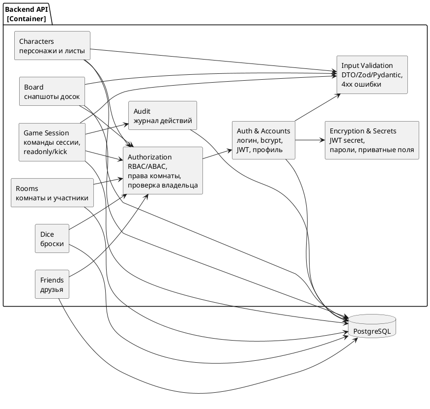

# Диаграмма 12. C4 Components: безопасность

## Промпт
Создай обновлённую C4 Component диаграмму ASTROLL после добавления аспектов безопасности. Вынеси Authorization как отдельный компонент проверки прав и политик доступа. Покажи Auth & Accounts, Friends, Characters, Board, Rooms, Game Session, Dice, Audit, Input Validation, Encryption/Secrets. Все защищённые компоненты используют Authorization. Audit получает события команд, а Encryption/Secrets используется для JWT secret, хеширования паролей и приватных данных.

## PlantUML

