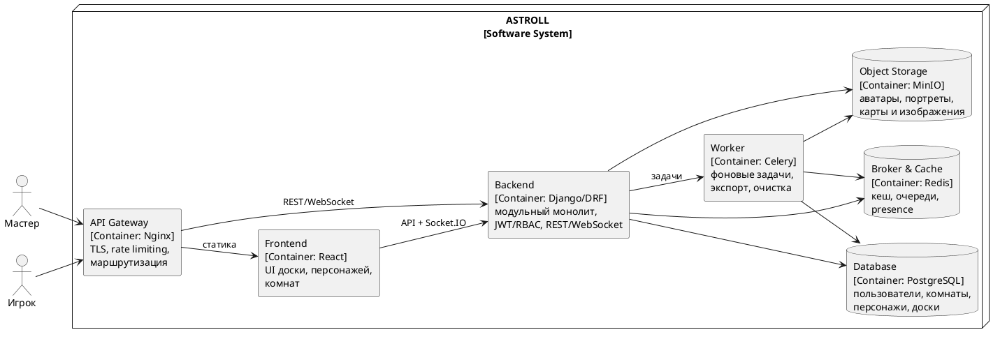

# Диаграмма 13. C4 Containers: защищённая сервисная поставка

## Промпт
Создай C4 Container диаграмму ASTROLL после добавления безопасности и контейнеризации. Пользователи Мастер и Игрок идут через API Gateway/Nginx. Есть Frontend React, Backend Django/DRF или FastAPI как модульный монолит, PostgreSQL, Redis, Object Storage/MinIO для изображений, Worker для фоновых задач и Broker. Gateway выполняет TLS termination, rate limiting и маршрутизацию; Backend выполняет JWT/RBAC и бизнес-логику.

## PlantUML

