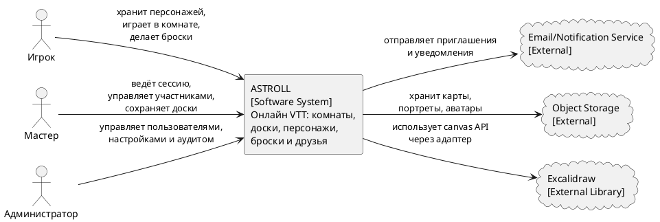

# Диаграмма 14. C4 Context: система ASTROLL

## Промпт
Создай C4 Context диаграмму всей системы ASTROLL. Персоны: Игрок, Мастер, Администратор. Центральная система: ASTROLL - веб-платформа для проведения онлайн настольных ролевых игр. Игрок хранит персонажей, подключается к комнатам, делает броски и взаимодействует с доской. Мастер создает и ведет комнаты, управляет участниками, сценами и снапшотами. Администратор управляет пользователями и эксплуатационными параметрами. Внешние системы: Email/Notification Service для уведомлений, Object Storage для медиа, Excalidraw как библиотека доски.

## PlantUML

