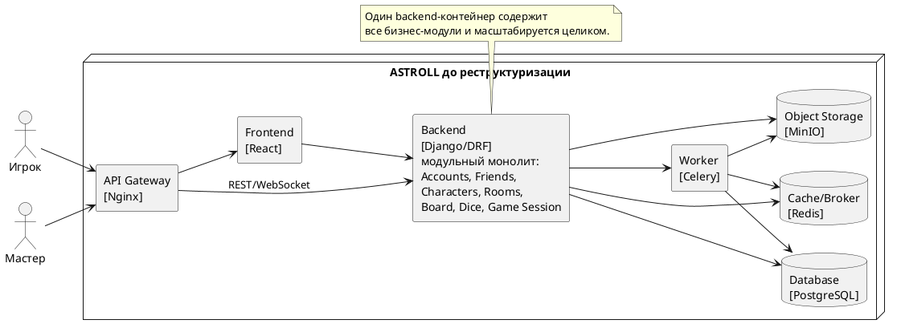

# Диаграмма 15. C4 Containers до реструктуризации

## Промпт
Создай C4 Container диаграмму ASTROLL до реструктуризации. Архитектура: сервисная архитектура с модульным backend-монолитом. Контейнеры: API Gateway, Frontend React, Backend Django/DRF с модулями Accounts, Friends, Characters, Rooms, Board, Dice, Game Session, PostgreSQL, Redis, Object Storage, Worker. Покажи, что весь доменный функционал находится в одном backend-контейнере, поэтому масштабируется целиком.

## PlantUML

