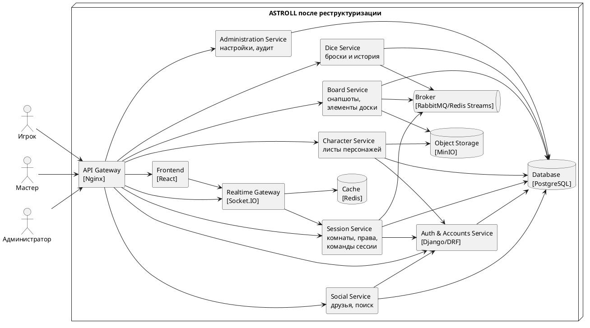

# Диаграмма 16. C4 Containers после реструктуризации

## Промпт
Создай C4 Container диаграмму ASTROLL после реструктуризации под рост нагрузки. Раздели монолит на крупные сервисы: Auth & Accounts Service, Social Service, Character Service, Session Service, Board Service, Dice Service, Realtime Gateway, Administration Service. Добавь API Gateway, Frontend, PostgreSQL, Redis, Broker, Object Storage. Покажи, что Session/Realtime/Board можно масштабировать независимо, а асинхронные события проходят через Broker.

## PlantUML

