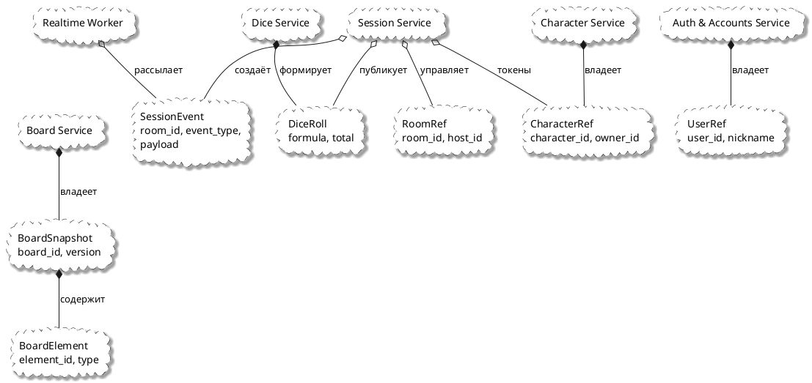

# Диаграмма 17. 4+1: логическое представление (рисунок 17)

## Назначение
Рисунок 17 отчёта ПР8. **Логическое представление** — облачная DDD-диаграмма связей сущностей и сервисов (не UML class diagram).

## Эталон (что должно получиться)
- **Облачные формы** (cloud) с **пунктирной границей**.
- Узлы-сущности: SessionEvent, BoardSnapshot, DiceRoll, RoomRef, CharacterRef и т.д.
- Узлы-сервисы: Session Service, Board Service, Auth Service...
- Связи с маркерами **○** (open circle) и **●** (filled circle) как в MDT.
- Стиль: белый фон, чёрный текст, layout сверху вниз.

## Промпт для генерации
```
Нарисуй Logical View (4+1) для ASTROLL после реструктуризации, стиль рис. 17 MDT.

НЕ UML class diagram. Используй cloud-узлы с пунктирной границей.

Сущности (cloud):
- SessionEvent — room_id, event_type, payload
- BoardSnapshot — board_id, version, elements
- BoardElement — element_id, type
- DiceRoll — room_id, formula, total
- RoomRef — room_id, host_id
- CharacterRef — character_id, owner_id
- UserRef — user_id, nickname

Сервисы (cloud, крупнее):
- Session Service
- Board Service
- Character Service
- Dice Service
- Auth & Accounts Service
- Realtime Worker

Связи (со маркерами):
- Session Service ○-- SessionEvent (создаёт)
- Session Service ○-- RoomRef (управляет)
- Session Service ○-- CharacterRef (использует токены)
- Board Service ●-- BoardSnapshot (владеет)
- BoardSnapshot ●-- BoardElement (содержит)
- Dice Service ●-- DiceRoll
- Session Service ○-- DiceRoll (публикует)
- Character Service ●-- CharacterRef
- Auth Service ●-- UserRef
- Realtime Worker ○-- SessionEvent (рассылает)

Layout: сервисы в центре, сущности вокруг, стрелки с подписями.
```

## PlantUML (готовая реализация)

