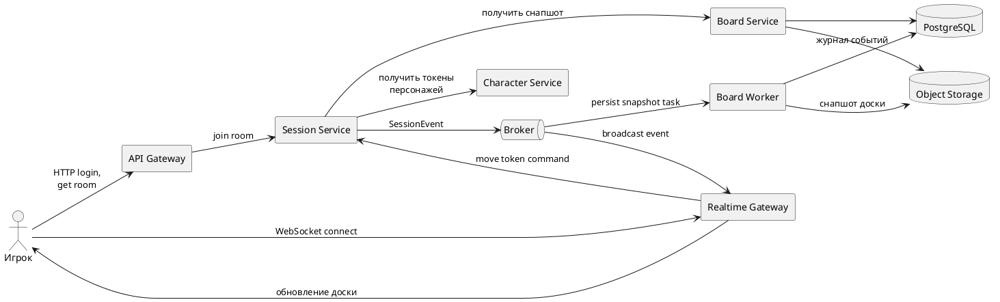

# Диаграмма 18. 4+1: процессное представление

## Промпт
Создай процессное представление ASTROLL. Синхронные HTTP-запросы идут через API Gateway к Auth, Character, Board и Session Service. Реалтайм-события доски и бросков идут через Realtime Gateway. Session Service публикует события в Broker, а Board Worker сохраняет снапшоты в Object Storage и PostgreSQL. Покажи сценарий: игрок подключается к комнате, получает снапшот, двигает токен, событие рассылается всем участникам и сохраняется в журнал.

## PlantUML

