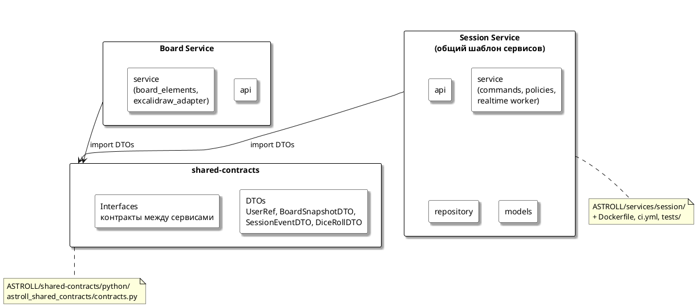

# Диаграмма 19. 4+1: представление уровня разработки (рисунок 19)

## Назначение
Рисунок 19 отчёта ПР8. **Development View** — структура репозитория и слоёв сервисов.

## Эталон (что должно получиться)
- **Session Service** (шаблон) — внутри 4 блока: **api**, **service**, **repository**, **models**; realtime-worker входит в слой service.
- **Board Service** — **api**, **app** (или service).
- **shared-contracts** снизу по центру: **DTOs**, **Interfaces**.
- Прямоугольники с тенью, layout треугольник как в MDT.
- Путь: `ASTROLL/services/*`, `ASTROLL/shared-contracts/`.

## Промпт для генерации
```
Нарисуй Development View (4+1) для ASTROLL, стиль рис. 19 MDT.

Три блока:

1. Session Service (общий шаблон сервисов) — большой прямоугольник с подписью «(общий шаблон сервисов)», внутри 4 ячейки:
   - api (FastAPI/uvicorn endpoints)
   - service (commands, policies)
   - repository (persistence)
   - models (domain)

2. Board Service — прямоугольник с api + service (excalidraw_adapter, board_elements)

3. shared-contracts — внизу по центру, внутри:
   - DTOs (UserRef, BoardSnapshotDTO, SessionEventDTO, DiceRollDTO)
   - Interfaces (контракты между сервисами)

Связи: Session Service и Board Service зависят от shared-contracts (стрелки вниз).

Также упомянуть в промпте: у каждого из 6 сервисов (`identity`, `characters`, `session`, `board`, `dice`, `administration`) есть Dockerfile, ci.yml, requirements.txt, tests/.
```

## PlantUML (готовая реализация)

