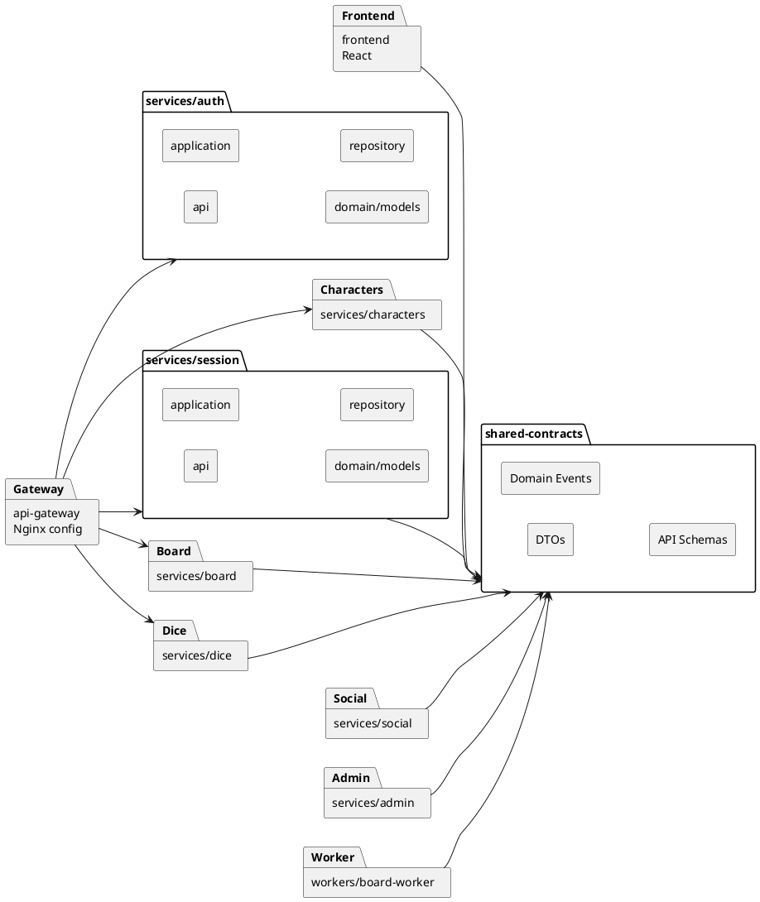

# Диаграмма 19. 4+1: представление уровня разработки

## Промпт
Создай development view для ASTROLL после реструктуризации. Покажи репозитории/пакеты сервисов: frontend, api-gateway, services/auth, services/characters, services/session, services/board, services/dice, services/social, services/admin, workers/board-worker, shared-contracts. В каждом backend-сервисе слои api, application/service, domain/models, repository, tests, Dockerfile, ci.yml. shared-contracts содержит DTO и события.

## PlantUML

