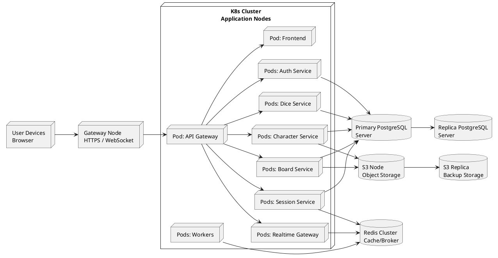

# Диаграмма 20. 4+1: физическое представление

## Промпт
Создай physical/deployment view ASTROLL. Пользователи и браузеры подключаются к Gateway Node. Внутри Kubernetes Cluster несколько application nodes с контейнерами frontend, api gateway, auth, session, realtime, board, characters, dice, workers. Отдельно покажи Primary PostgreSQL и Replica PostgreSQL, Redis Cluster/Broker, Object Storage Node и Storage Replica. Gateway принимает HTTPS/WebSocket. Сервисы масштабируются горизонтально.

## PlantUML

