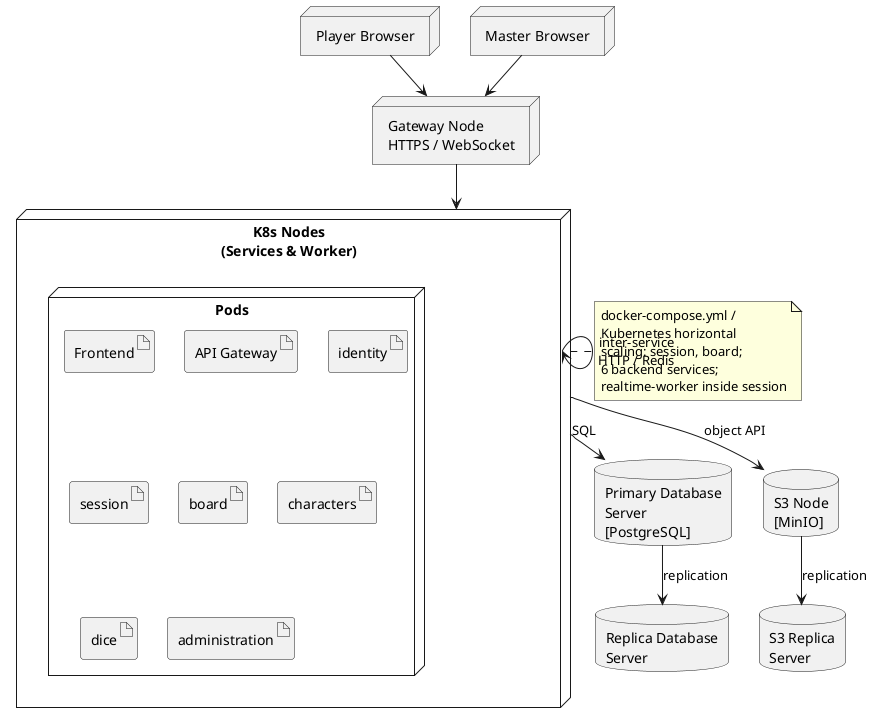

# Диаграмма 20. 4+1: физическое представление (рисунок 20)

## Назначение
Рисунок 20 отчёта ПР8. **Physical/Deployment View** — Docker/K8s развёртывание.

## Эталон (что должно получиться)
- **Player Browser** и **Master Browser** сверху (вместо Camera + Operator в MDT).
- **Gateway Node** — единая точка входа HTTPS/WSS.
- **K8s Nodes** — стопка квадратов (несколько pod'ов).
- **Primary PostgreSQL → Replica PostgreSQL** (репликация).
- **S3 Node → S3 Replica** (реплика хранилища).
- Чёрно-белый deployment-стиль как MDT рис. 20.
- Источник: `ASTROLL/docker-compose.yml`.

## Промпт для генерации
```
Нарисуй Physical/Deployment View (4+1) для ASTROLL, стиль рис. 20 MDT.

Сверху external nodes:
- Player Browser — браузер игрока
- Master Browser — браузер мастера
Оба → Gateway Node (HTTPS / WebSocket)

Gateway Node → K8s Nodes (стопка из 3 квадратов, подпись «Services & Worker»):
  Pods: Frontend, API Gateway, identity, session, board, characters, dice, administration
  Note: всего 6 backend-сервисов; realtime-worker входит в pod/deployment `session`.

Справа storage tier (два ряда):
- Primary Database Server → Replica Database Server (PostgreSQL)
- S3 Node (MinIO) → S3 Replica Server

K8s → Primary DB, K8s → S3 Node
Self-loop на K8s (внутренняя коммуникация сервисов)

Подписи на русском. Чёрно-белая deployment diagram.
```

## PlantUML (готовая реализация)

