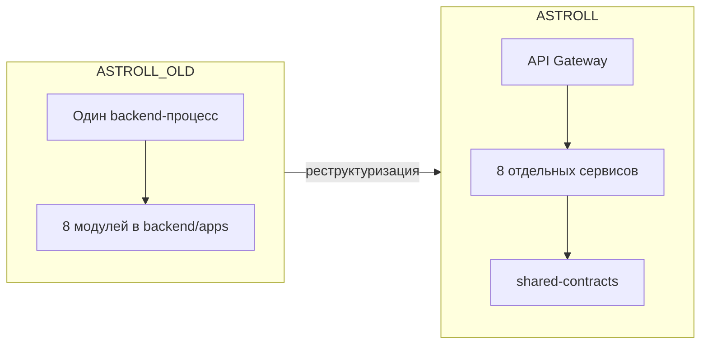
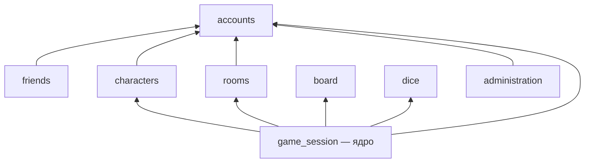
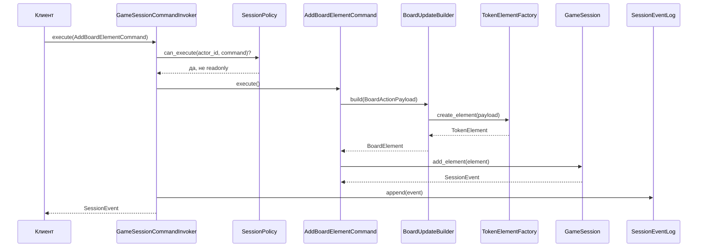
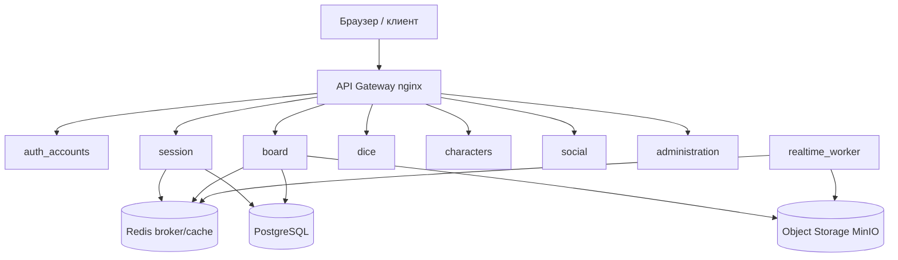
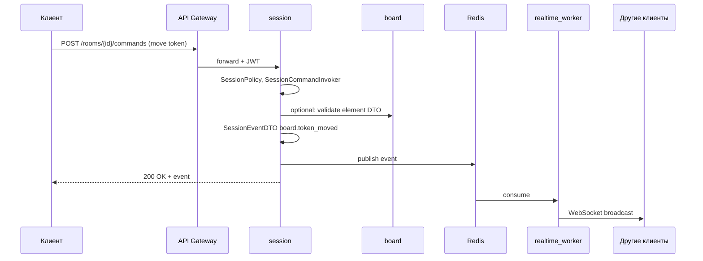

СОДЕРЖАНИЕ

1 Цель
2 Задачи
3 Ход выполнения
3.1 Реализуемая система ASTROLL
3.2 ASTROLL_OLD: модульный монолит (подробная документация)
3.2.1 Что такое модульный монолит и зачем он нужен
3.2.2 Структура папок и файлов
3.2.3 Описание каждого модуля
3.2.4 Схема зависимостей между модулями
3.2.5 Логика работы: сценарии и потоки данных
3.2.6 Паттерны проектирования в ASTROLL_OLD
3.2.7 Как читать код ASTROLL_OLD (гайд для джуна)
3.3 ASTROLL: сервисная архитектура (подробная документация)
3.3.1 Что такое сервисная архитектура и чем она отличается от монолита
3.3.2 Структура папок и файлов
3.3.3 Описание каждого сервиса
3.3.4 shared-contracts: общий язык между сервисами
3.3.5 Инфраструктура и docker-compose
3.3.6 Логика работы: сценарии и потоки данных
3.3.7 Сравнение ASTROLL_OLD и ASTROLL
3.4 Требования к системе
3.5 ADR и реструктуризация архитектуры
3.6 DDD и C4
3.7 Паттерны проектирования
3.8 SOLID и компонентные принципы
3.9 Безопасность
3.10 Представление 4+1
4 Выводы

---

1 Цель

Цель работы — спроектировать и реализовать учебную архитектуру ASTROLL (веб-система для проведения настольных ролевых игр онлайн) и показать развитие проекта от модульного монолита `ASTROLL_OLD` к сервисной архитектуре `ASTROLL`.

Отчёт описывает не абстрактную систему, а **фактически созданные папки проекта**:
- `ASTROLL_PrPO/ASTROLL_OLD` — начальная реализация в виде модульного монолита;
- `ASTROLL_PrPO/ASTROLL` — реструктурированная реализация в виде набора сервисов;
- `ASTROLL_PrPO/diagram_prompts` — промпты и PlantUML-схемы для диаграмм.

---

2 Задачи

- описать предметную область ASTROLL и роли пользователей;
- сформулировать требования к игровой VTT-платформе;
- реализовать `ASTROLL_OLD` как модульный монолит;
- реализовать `ASTROLL` как сервисную архитектуру;
- выделить DDD-контексты и C4-представления;
- реализовать Factory Method, Adapter и Command;
- показать OCP, LSP и DIP;
- показать REP, CCP, ADP и SDP;
- описать безопасность и компромиссы;
- **подробно задокументировать устройство и логику обеих реализаций**.

---

3 Ход выполнения

3.1 Реализуемая система ASTROLL

ASTROLL — веб-система для проведения настольных ролевых игр онлайн (Virtual Tabletop). Она предоставляет мастеру и игрокам общую игровую доску, комнаты, токены персонажей, изображения, броски кубов, историю событий и хранение листов персонажей.

**Роли:**
| Роль | Что делает |
|------|------------|
| Игрок | Регистрируется, создаёт персонажей, подключается к комнате, видит доску, делает броски |
| Мастер | Создаёт комнату, управляет участниками, readonly/kick, управляет доской, сохраняет сессию |
| Администратор | Эксплуатационные настройки, пользователи, аудит, безопасность |

**Две версии архитектуры в репозитории:**



---

3.2 ASTROLL_OLD: модульный монолит (подробная документация)

3.2.1 Что такое модульный монолит и зачем он нужен

**Модульный монолит** — это одно приложение (один процесс, один деплой), внутри которого код **разделён на модули по предметным областям**. Модули не смешиваются: у каждого своя папка и зона ответственности, но все они работают в одной памяти и могут вызывать друг друга напрямую через import.

**Плюсы для старта проекта:**
- один запуск, одна база данных, проще отладка;
- транзакции и согласованность данных «из коробки»;
- меньше инфраструктуры (не нужны брокер, отдельные контейнеры на каждый модуль).

**Минусы при росте нагрузки:**
- масштабируется **весь** backend целиком, а не только «тяжёлая» часть (например, realtime-сессии);
- падение одного модуля может затронуть весь процесс.

В `ASTROLL_OLD` это учебная демонстрация: **бизнес-логика не размазана по слоям**, а собрана в доменных модулях `accounts`, `board`, `game_session` и т.д.

3.2.2 Структура папок и файлов

```
ASTROLL_OLD/
├── README.md                          # краткое описание монолита
└── backend/
    ├── manage.py                      # точка входа (как у Django)
    ├── requirements.txt               # django, djangorestframework, pyjwt, bcrypt
    ├── config/
    │   ├── settings.py                # INSTALLED_APPS = все модули apps.*
    │   └── urls.py                    # маршрут GET /api/health
    └── apps/
        ├── views.py                   # health-check JSON
        ├── components.py              # граф зависимостей модулей (ADP)
        ├── classes.puml               # UML основных классов
        ├── accounts/models.py         # UserProfile, RBACPolicy
        ├── friends/models.py          # FriendLink, FriendPolicy
        ├── characters/models.py       # Character, CharacterSheet, CharacterAccessPolicy
        ├── rooms/models.py            # Room, RoomMember
        ├── board/
        │   ├── elements.py            # Factory Method: элементы доски
        │   └── adapters.py            # Adapter: Excalidraw ↔ домен
        ├── dice/models.py             # DiceRollEntry, DiceRoller
        ├── game_session/commands.py   # Command: ядро сессии
        └── administration/services.py # RuntimeSettings, AdministrationPolicy
```

**Как запустить (минимально):**
1. Перейти в `ASTROLL_OLD/backend`.
2. Установить зависимости: `pip install -r requirements.txt`.
3. При необходимости: `python manage.py` (в учебном каркасе достаточно импорта модулей и `python -m compileall .`).

Health-check: `GET /api/health` → `{"status": "ok", "system": "ASTROLL_OLD"}`.

3.2.3 Описание каждого модуля

| Модуль | Путь | Зона ответственности | Ключевые классы |
|--------|------|----------------------|-----------------|
| **accounts** | `apps/accounts/models.py` | Пользователи, роли, RBAC | `UserRole`, `UserProfile`, `RBACPolicy` |
| **friends** | `apps/friends/models.py` | Друзья, запрет добавить себя | `FriendLink`, `FriendPolicy` |
| **characters** | `apps/characters/models.py` | Персонажи, JSON-листы, владелец | `Character`, `CharacterSheet`, `CharacterAccessPolicy` |
| **rooms** | `apps/rooms/models.py` | Комната, участники, хост, readonly | `Room`, `RoomMember` |
| **board** | `apps/board/` | Элементы доски, снапшоты, Excalidraw | `BoardElement`, `BoardUpdateBuilder`, `ExcalidrawSnapshotAdapter` |
| **dice** | `apps/dice/models.py` | Броски d20, история | `DiceRollEntry`, `DiceRoller` |
| **game_session** | `apps/game_session/commands.py` | **Смысловое ядро**: команды, права, события | `GameSession`, `*Command`, `GameSessionCommandInvoker` |
| **administration** | `apps/administration/services.py` | Лимиты комнаты, автосохранение | `RuntimeSettings`, `AdministrationPolicy` |

**accounts** — «фундамент» идентичности. Все остальные модули опираются на `user_id` и роли (`player`, `master`, `admin`). `RBACPolicy.can_host_room()` нужен, чтобы понять, может ли пользователь создавать комнату.

**characters** — персонаж принадлежит одному владельцу (`owner_id`). `CharacterAccessPolicy` не даёт читать/менять чужого персонажа — это основа безопасности данных листа.

**rooms** — комната имеет `host_id` (мастер). `RoomMember.readonly` — флаг «только просмотр». Методы `set_readonly`, `is_host` используются из `game_session`.

**board** — всё, что рисуется на поле: токены, картинки, текст, фигуры, штрихи. Сохранение состояния — через `BoardSnapshot` и адаптер к формату Excalidraw.

**dice** — простой генератор броска `1d20+modifier` с записью в `DiceRollEntry`.

**game_session** — **центр системы**. Не хранит «всё подряд», а **оркестрирует**: получает команду от пользователя, проверяет права, меняет состояние комнаты/доски/бросков, создаёт `SessionEvent`, пишет в журнал и (опционально) публикует в realtime.

**administration** — параметры вроде `max_room_members=8`, `autosave_interval_seconds=30`; проверка прав админа через `AdministrationPolicy` + `RBACPolicy`.

3.2.4 Схема зависимостей между модулями

Зависимости зафиксированы в `ASTROLL_OLD/backend/apps/components.py`. Направление: **downstream → upstream** (модуль справа зависит от модуля слева).



**Правило для джуна:** стрелка «A → B» значит «A использует B». Циклов нет — функция `has_cycles()` в `components.py` должна возвращать `False`. Самый «нестабильный» и изменчивый модуль — `game_session`; самый стабильный — `accounts`.

3.2.5 Логика работы: сценарии и потоки данных

**Сценарий A: игрок добавляет токен персонажа на доску**



Пошагово:
1. Клиент формирует `BoardActionPayload` (`element_type="token"`, `character_id`, позиция).
2. Создаётся `AddBoardElementCommand` с `BoardUpdateBuilder` (внутри — реестр фабрик).
3. `GameSessionCommandInvoker.execute()` сначала спрашивает `SessionPolicy`: участник в комнате и не в readonly?
4. Команда вызывает `builder.build()` → фабрика `TokenElementFactory` → объект `TokenElement`.
5. `GameSession.add_element()` кладёт элемент в список и возвращает `SessionEvent` с типом `board.element_added`.
6. Invoker пишет событие в `SessionEventLog` и может вызвать `RealtimeEventPublisher`.

**Сценарий B: мастер включает readonly игроку**

1. Создаётся `SetReadonlyCommand(session, master_id, player_id, readonly=True)`.
2. `SessionPolicy`: для `SetReadonlyCommand` и `KickPlayerCommand` разрешено **только** если `room.is_host(actor_id)`.
3. `GameSession.set_readonly()` → `Room.set_readonly()` → событие `room.readonly_changed`.

**Сценарий C: сохранение снапшота доски (Adapter)**

1. Мастер вызывает `SaveBoardSnapshotCommand` с `BoardSnapshotProvider` (реализация — `ExcalidrawSnapshotAdapter`).
2. `provider.save_snapshot(board_id, session.board)`.
3. Адаптер переводит доменный `BoardSnapshot` в `ExcalidrawJson` и отдаёт во `ExcalidrawClient.write_scene()`.
4. Домен **не знает** деталей JSON Excalidraw — только свой `BoardSnapshot`.

**Сценарий D: бросок куба**

1. `RollDiceCommand` → `GameSession.roll_dice()` → `DiceRoller.roll_d20()`.
2. Результат в `DiceRollEntry`, событие `dice.rolled` с payload `{formula, total, ...}`.

3.2.6 Паттерны проектирования в ASTROLL_OLD

| Паттерн | Где в коде | Зачем |
|---------|------------|-------|
| **Factory Method** | `board/elements.py` | Разные типы элементов доски создаются через общий интерфейс фабрики; клиент `BoardUpdateBuilder` не знает про `TokenElement` vs `ImageElement` |
| **Adapter** | `board/adapters.py` | Excalidraw JSON ↔ доменный `BoardSnapshot`; замена библиотеки доски не ломает `game_session` |
| **Command** | `game_session/commands.py` | Каждое действие игрока/мастера — объект с `execute()`; единая точка проверки прав и аудита через Invoker |

**Factory Method — мини-пример для понимания:**

```python
# Клиент не пишет: if type == "token": TokenElement(...)
payload = BoardActionPayload(room_id="r1", author_id=5, element_type="token", data={...})
element = BoardUpdateBuilder(default_element_registry()).build(payload)
# element — BoardElement, конкретный класс выбрала фабрика
```

**Command — цепочка ответственности:**

```
Пользователь → Command → SessionPolicy (можно?) → command.execute() → SessionEvent → Log + Publisher
```

3.2.7 Как читать код ASTROLL_OLD (гайд для джуна)

1. **Начни с `game_session/commands.py`** — там видно, что система «делает» в игре.
2. **Открой `rooms/models.py`** — поймёшь, кто мастер и что такое readonly.
3. **Загляни в `board/elements.py`** — как устроена доска.
4. **Посмотри `components.py`** — кто от кого зависит.
5. **Открой `classes.puml`** в PlantUML — общая картина классов.

**Частые вопросы:**
- *Где HTTP API для комнат?* — в учебном каркасе только `/api/health`; доменная логика вынесена в классы для отчёта по архитектуре.
- *Где база данных?* — в `settings.py` указан SQLite; модели сейчас dataclass, без Django ORM migrations — это **архитектурный скелет**.
- *Как добавить новый тип элемента доски?* — новый класс `*Element`, новая `*Factory`, регистрация в `default_element_registry()`; `BoardUpdateBuilder` не менять (OCP).

---

3.3 ASTROLL: сервисная архитектура (подробная документация)

3.3.1 Что такое сервисная архитектура и чем она отличается от монолита

После роста числа комнат и realtime-событий монолит масштабируется **целиком**. **Сервисная архитектура** делит систему на **отдельные deployable-единицы** (контейнеры/процессы). Каждый сервис:
- имеет свою зону ответственности;
- общается с другими через **сеть** (HTTP) и **контракты** (DTO из `shared-contracts`), а не через прямой `import`;
- может масштабироваться независимо (например, три реплики `session`, одна `administration`).



3.3.2 Структура папок и файлов

```
ASTROLL/
├── README.md
├── docker-compose.yml                 # gateway + 8 сервисов + postgres + redis + minio
├── shared-contracts/
│   ├── README.md
│   └── python/astroll_shared_contracts/
│       ├── __init__.py
│       └── contracts.py               # UserRef, BoardSnapshotDTO, SessionEventDTO, ...
└── services/
    ├── auth_accounts/                 # api/, service/, models/, repository/, tests/
    ├── social/
    ├── characters/
    ├── session/                       # commands.py — ядро в сервисной форме
    ├── board/                         # board_elements.py, excalidraw_adapter.py
    ├── dice/
    ├── administration/
    └── realtime_worker/               # orchestrator.py — публикация и сохранение
```

**Шаблон каждого сервиса:**

| Файл/папка | Назначение |
|------------|------------|
| `api/main.py` | FastAPI, endpoint `/health` |
| `service/` | Бизнес-логика сервиса |
| `models/` | Доменные модели этого сервиса |
| `repository/` | Доступ к БД (заготовка) |
| `tests/` | Тесты (заготовка) |
| `Dockerfile` | Сборка контейнера |
| `requirements.txt` | fastapi, pydantic, uvicorn |
| `ci.yml` | `python -m compileall .` |
| `README.md` | Описание сервиса |

3.3.3 Описание каждого сервиса

| Сервис | Папка | Аналог в ASTROLL_OLD | Ответственность |
|--------|-------|---------------------|-----------------|
| **auth_accounts** | `services/auth_accounts` | `accounts` | `User`, `Role`, `AuthorizationPolicy`; JWT, профиль |
| **social** | `services/social` | `friends` | Друзья, поиск пользователей |
| **characters** | `services/characters` | `characters` | `Character`, `CharacterSheet`, экспорт `CharacterRef` |
| **session** | `services/session` | `game_session` + часть `rooms` | `SessionState`, команды, `SessionCommandInvoker` |
| **board** | `services/board` | `board` | `BoardApplicationService`, Excalidraw adapter, DTO элементов |
| **dice** | `services/dice` | `dice` | `DiceApplicationService.roll_d20()` → `DiceRollDTO` |
| **administration** | `services/administration` | `administration` | `RuntimeSettings`, лимиты комнаты |
| **realtime_worker** | `services/realtime_worker` | publisher + фон | `RealtimeGateway`, `SnapshotPersistenceWorker` |

**auth_accounts** — единственный источник правды о пользователе. Другие сервисы получают не «полный User», а лёгкий `UserRef(user_id, nickname)` из контрактов.

**session** — координатор игры в распределённой системе. Не хранит тяжёлые снапшоты доски внутри себя: просит **board** создать/обновить DTO, **dice** — результат броска, затем формирует `SessionEventDTO` и отдаёт в очередь для **realtime_worker**.

**realtime_worker** — асинхронный контур. Синхронный HTTP в `session` быстро отвечает клиенту; тяжёлая рассылка и запись снапшота в S3 идут через broker (Redis в `docker-compose.yml`).

3.3.4 shared-contracts: общий язык между сервисами

Файл: `ASTROLL/shared-contracts/python/astroll_shared_contracts/contracts.py`

**Зачем:** если `session` импортировал бы класс `Character` из `characters`, сервисы срослись бы в «распределённый монолит». DTO — **стабильный контракт**: только поля, нужные получателю.

| DTO | Поля | Кто публикует | Кто потребляет |
|-----|------|---------------|----------------|
| `UserRef` | user_id, nickname | auth_accounts | session, social, characters |
| `CharacterRef` | character_id, owner_id, name | characters | session, board (токены) |
| `RoomRef` | room_id, host_id | session | board, dice, realtime_worker |
| `BoardElementDTO` | element_id, element_type, payload | board | session, realtime_worker |
| `BoardSnapshotDTO` | board_id, room_id, version, elements | board | realtime_worker, клиент |
| `DiceRollDTO` | room_id, author_id, formula, total | dice | session, realtime_worker |
| `SessionEventDTO` | room_id, event_type, payload | session | realtime_worker, клиенты WS |

**Пример события после броска:**

```json
{
  "room_id": "room-abc",
  "event_type": "dice.rolled",
  "payload": {
    "room_id": "room-abc",
    "author_id": 5,
    "formula": "1d20+3",
    "total": 17
  }
}
```

3.3.5 Инфраструктура и docker-compose

`ASTROLL/docker-compose.yml` описывает:

| Контейнер | Роль |
|-----------|------|
| `api-gateway` | nginx, маршрутизация, TLS (в prod), rate limit |
| `auth-accounts` … `realtime-worker` | бизнес-сервисы |
| `postgres` | транзакционные данные |
| `redis` | broker + cache (очереди событий, presence) |
| `object-storage` (minio) | карты, портреты, файлы снапшотов |

**Запуск (концептуально):** из корня `ASTROLL/` — `docker compose up --build`. Каждый сервис поднимает uvicorn на `/health`.

3.3.6 Логика работы: сценарии и потоки данных

**Сценарий 1: игрок двигает токен (сервисная версия)**



Отличие от монолита: шаги **board** и **session** могут быть в **разных процессах**; связь через HTTP + DTO, а не `from apps.board import ...`.

**Сценарий 2: сохранение снапшота (асинхронно)**

1. Мастер инициирует сохранение через `session`.
2. `session` запрашивает у `board` актуальный `BoardSnapshotDTO`.
3. `session` кладёт задачу в Redis.
4. `realtime_worker.SnapshotPersistenceWorker.persist_snapshot()` формирует `BrokerMessage` с routing key `board.{id}.snapshot.persisted`.
5. Worker записывает JSON в MinIO и метаданные в PostgreSQL.

**Сценарий 3: регистрация и вход**

1. `auth_accounts` создаёт пользователя, хеш пароля (bcrypt — по требованиям NFR).
2. Выдаёт JWT; Gateway пробрасывает `Authorization: Bearer`.
3. `session` и `characters` доверяют `user_id` из токена, не дублируя таблицу пользователей.

**Код realtime_worker (упрощённо):**

```python
# RealtimeGateway.publish_to_room(SessionEventDTO)
# → BrokerMessage(routing_key="room.{room_id}.{event_type}", payload=...)
```

3.3.7 Сравнение ASTROLL_OLD и ASTROLL

| Критерий | ASTROLL_OLD | ASTROLL |
|----------|-------------|---------|
| Deploy | 1 backend | 8+ контейнеров |
| Связь модулей | Python import | HTTP + DTO + broker |
| Масштабирование | всё приложение | session, board, realtime_worker отдельно |
| БД | одна SQLite/PostgreSQL | PostgreSQL (логически разделено по сервисам) |
| Realtime | `NullRealtimeEventPublisher` в процессе | отдельный `realtime_worker` + Redis |
| Сложность для джуна | проще начать читать | сложнее инфраструктура, проще границы |
| Паттерны | Factory, Adapter, Command в одном repo | те же идеи, DTO на границах |
| Файл ядра | `game_session/commands.py` | `session/service/commands.py` |
| Контракты | общие dataclass внутри apps | `shared-contracts/contracts.py` |

**Когда оставаться на OLD:** мало пользователей, одна команда, важна простота деплоя.

**Когда переходить на ASTROLL:** много одновременных комнат, пики realtime, нужна независимая выкладка `board`/`session`.

---

3.4 Требования к системе

(См. также `project_astroll.md` — исходный сбор требований.)

**Бизнес-требования:** единая VTT-платформа, меньше рутины, синхронная доска, сохранность данных, контроль мастера, готовность к росту.

**Функциональные:** регистрация, персонажи, комнаты, доска, броски, realtime, health.

**Нефункциональные:** RBAC, 2–8 игроков на комнату, масштабирование session/board, Dockerfile на сервис.

---

3.5 ADR и реструктуризация архитектуры

**ADR-1:** старт с `ASTROLL_OLD` (модульный монолит).

**ADR-2:** целевое состояние `ASTROLL` (сервисы + shared-contracts + broker + object storage).

Причины перехода: масштабируемость realtime, отказоустойчивость, независимый релиз нагруженных сервисов.

---

3.6 DDD и C4

**Смысловое ядро:** Game Session / VTT.

**Контексты в OLD:** папки `backend/apps/*`.

**Контексты в ASTROLL:** папки `services/*`.

Диаграммы: каталог `diagram_prompts/` (01–20).

---

3.7 Паттерны проектирования

Подробно — в п. 3.2.6 (OLD) и аналогичные классы в `ASTROLL/services/board` и `ASTROLL/services/session`.

---

3.8 SOLID и компонентные принципы

- **OCP/LSP:** иерархия `BoardElement` / фабрики.
- **DIP:** Invoker → абстракции Log и Publisher.
- **REP/CCP/ADP/SDP:** модули/сервисы и `components.py` / `shared-contracts`.

---

3.9 Безопасность

- RBAC: `RBACPolicy`, `AuthorizationPolicy`.
- Владелец персонажа: `CharacterAccessPolicy`.
- Права в комнате: `SessionPolicy` (readonly, только хост для kick/readonly).
- Изоляция: Docker, Gateway, без прямого доступа сервисов к чужим БД.

---

3.10 Представление 4+1

| View | OLD | NEW |
|------|-----|-----|
| Logical | модули apps | сервисы + DTO |
| Process | вызовы внутри процесса | Gateway → сервисы → Redis → worker |
| Development | один backend | services/* + shared-contracts |
| Physical | 1 контейнер | docker-compose.yml |
| Scenarios | Invoker в game_session | session + realtime_worker |

Диаграммы: `diagram_prompts/17`–`20`.

---

4 Выводы

Работа содержит **две согласованные реализации** одной предметной области:

**ASTROLL_OLD** — модульный монолит для обучения архитектуре: один процесс, явные модули, паттерны Factory Method, Adapter и Command в файлах `board/` и `game_session/`, граф зависимостей в `components.py`.

**ASTROLL** — сервисная архитектура для масштабирования: восемь сервисов, общие контракты, асинхронный `realtime_worker`, инфраструктура в `docker-compose.yml`.

Документация в разделах 3.2 и 3.3 привязана к **реальным путям файлов**, чтобы разработчик начального уровня мог открыть репозиторий, пройти сценарий по sequence-диаграмме и найти соответствующий класс в коде.

Переход от OLD к NEW — не «переписывание с нуля», а **перенос границ**: то, что было модулем `game_session`, стало сервисом `session` + `realtime_worker`; то, что было `board`, стало сервисом `board` с DTO на границе.
